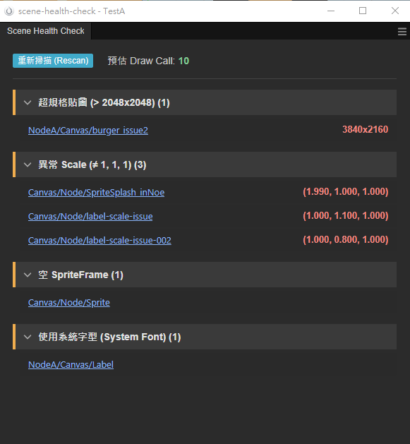

# Scene Health Check

Cocos Creator 3.x 的場景資源健康度掃描工具，幫助開發者快速識別場景中的效能隱患，並提供直觀的數據反饋。

## 1. 安裝與執行
1.  **安裝依賴**：於插件根目錄執行 `npm install`。
2.  **編譯插件**：執行 `npm run build` (將 `source` 中的 TypeScript 編譯至 `dist`)。
3.  **載入外掛**：在 Cocos Creator 「外掛管理」中載入本目錄。
4.  **執行路徑**：`主選單 -> Tools-dev -> Scene Health Check`。

## 2. 技術架構與設計決策
*   **跨進程通訊架構 (Cross-Process Architecture)**：
    由於 Cocos Creator 3.x 的環境隔離機制，本工具採用 **Panel-Scene 隔離模式**。介面邏輯 (Vue 3) 運行於 Panel 進程，而場景掃描邏輯則運行於 Scene 進程。我們透過 `Editor.Message` 建立通訊橋樑，實作「介面請求 -> 場景掃描 -> 數據回傳」的異步流，確保 UI 操作不干擾引擎渲染效能。
    
*   **關鍵 API 應用**：
    *   **進程通訊**：使用 `Editor.Message.request('scene', 'execute-scene-script', ...)`。
    *   **環境操作**：透過 `cc.director.getScene()` 存取運行時場景樹。
    *   **數據檢索**：運用 `getComponentsInChildren('cc.Node')` 進行深度優先遍歷 (DFS)。
    *   **資源追蹤**：存取 `sprite.spriteFrame.texture.uuid` 與材質對象進行合批分析。
    *   **編輯器交互**：利用 `Editor.Selection.clear` 與 `select` 實作報告項目與場景節點的精確選取跳轉。

*   **渲染預估 (Draw Call Simulation)**：
    不採用簡易的元件計數，而是實作一套「渲染模擬器」。透過追蹤 DFS 序列中連續節點的 **Material UUID** 與 **Texture UUID**，動態判定合批 (Batching) 可能性，提供更貼近真實 Profiler 的 Draw Call 預估值（參考：[論壇討論](https://forum.cocos.org/t/topic/132490)）。

## 3. 已知限制
*   **3D 合批判定**：目前對 3D GPU Instancing 的合批判定採保守估計。
*   **動態性限制**：目前僅支援對當前活躍 (Active) 且已開啟的場景進行檢查。

## 4. 未來改善計畫
1.  **非開啟式批量檢查**：預計整合 `AssetDB` 掃描，實作在不手動開啟檔案的情況下，對全專案的 `.scene` 與 `.prefab` 進行自動化批次健康檢查。
2.  **深度合批檢查**：優化 `cc.Label` (BMFont) 與 3D 渲染順序的合批判定算法，提供更精準的渲染批次分析。
3.  **一鍵規範化 (Auto-Fix)**：自動修正不合規範的 Scale 誤差、空 Sprite 佔位與系統字體設定。

## 5. AI 協作說明
*   **自己部分**：定義場景檢查的核心邏輯、查找 extension 架構、場景節點過濾規則。
*   **AI 協助部分**：全部 TypeScript，HTML
*   **超出獨立完成範圍**: 手刻 TypeScript，HTML
